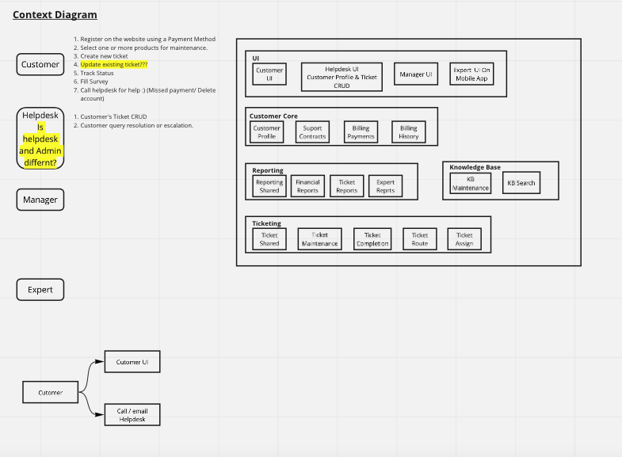

# Continuous Integration and Delivery

### Goals
The route to live should be 
1. Fast
1. Protect current functionality
1. Automated

### Overview

The above goals will be realized by the CI/CD pipeline, which includes different test suites to protect current functionality.

The above figure depicts the CI/CD pipeline flow
1. Developer will check-in the code(including unit test) into version control system.
1. The CI/CD automation tool (Jenkins) will listen to the check-ins, and on each trigger it will run clean, build, unit tests.
1. To keep the code quality to an acceptable standard. The static code analysis tool will be used.
1. After the code analysis is successful, the deployment artifacts will be stored in artifact repository. 
1. The first deployment will be done on Development environment.
1. If deployment is successful, component and smoke tests will be performed.
1. Depending on the requirement to deploy on higher environments, authorized user can further push the artifacts, which 
will have additional test suites to be tested based on the environment. This cycle can go up to Production.
 

