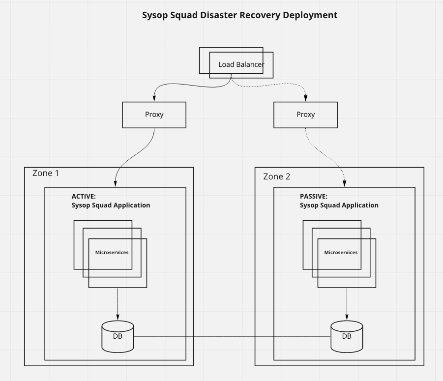

# Disaster Recovery Deployment

As shown in the diagram below, the services will be deployed in an Active-Passive failover configuration, front-ended by a load balancer cluster. The load balancer would allow us to switch from Active zone to the Passive zone, in  case all the services in the Active zone are unavailable. Within each zone, multiple instances of each microservice will be deployed to provide the required high availability at individual service level. There would be continuous replication of the database in the Active configuration, to the database in the Passive configuration.

