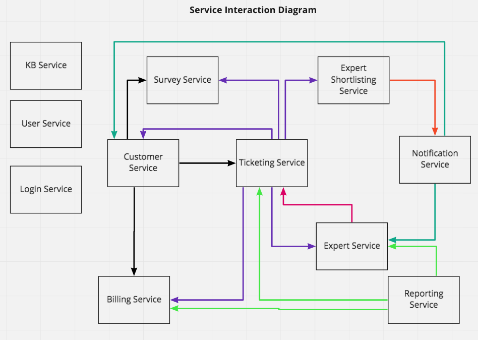

## Microservices Details:

The monolith will be divided into several microservices, their details and interaction is given below. 

### High level responsibility of each microservice 

#### Login Service
Internal User, Customer Login and Security Logic

#### Customer Service
Maintain Customer Profile, customer registration
Support contracts for a Customer and Products in the plan

#### Expert Service 
Maintain Expert Profile (Name, Location, skills etc.)

#### Ticketing Service
Ticket creation, maintenance, completion, common code

#### Notification Service
Sends the ticket to the experts mobile device app
Sends survey email to customers

#### KB Service (Knowledge Base)
Maintain and view items in the knowledge base
Query engine for searching the knowledge base

#### Reporting Service
All reporting (experts, tickets, financial) 

#### Survey Service
Maintain Survey, Capture and Record Survey Results

#### Expert Shortlisting Service
Find the expert and assign the ticket
Notify Customer that expert is on the way

#### Billing Service
Customer monthly billing and customer credit card info
Payment History and prior billing statements

#### User Service
Maintain internal users and role
