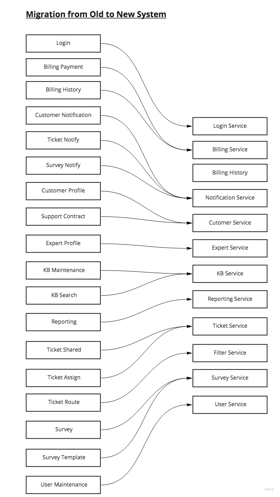

### Pre-requisites
1. Automated regression test suite.

### Migration Approach
1. The first service to be migrated is the "Ticket Service". Followed by one micro-service at a time. 
This is only service, which has functional changes as per solution design. 
1. The migration will be based on 'phased delivery' for each micro-service.
1. The Strangler Pattern will be used. The monolith will be decommissioned after six months of successful run of the last micro-services. 
1. Another benefit of Strangler Pattern is that the expected downtime is minimal, still the initial few
deployments will be done during non/low business hours.
1. Below steps will be followed for each microservice deployment in production environment.   
   1. The monolith application will be stopped
   1. Any running microservice will be stopped.
   1. Database of the new deploying microservice will be migrated from old to new DB.
   1. Microservice will be started followed by the monolith application.
   1. Post deployment smoke test. 

  
<s>* Downtime is OK, so we can:
  * take the current system down,
  * do the data migration (shouldn't be big -- clarify??? how many tickets there already?)
  * Run QA UI to ensure the new system works (need all the key test cases ready)
  * Bring the new system live
</s>
----
Existing to new Components Mapping

| # | Existing Systems's Component | New System's Component | Action |
|----|----|----|----|
|1.  | Login                 | Login Service         | Rename of the service                         | 
|2.  | Billing Payment       | Billing Service       | Merged into new service                       | 
|3.  | Billing History       | Billing Service       | Merged into new service                       | 
|4.  | Customer Notification | Notification Service  | New Service for all notifications             | 
|5.  | Ticket Notify         | Notification Service  | New Service for all notifications             |
|6.  | Survey Notify         | Notification Service  | New Service for all notifications             |
|7.  | Customer Profile      | Customer Service      | Merged into new service                       |
|8.  | Support Contract      | Customer Service      | Merged into new service                       | 
|9.  | Expert Profile        | Expert Service        | Rename of the service                         | 
|10. | KB Maintenance        | KB Service            | Merged into new service                       | 
|11. | KB Search             | KB Service            | Merged into new service                       | 
|12. | Reporting             | Reporting Service     | Rename of the service                         | 
|13. | Ticket Shared         | Ticket Service        | Merged into new service                       | 
|14. | Ticket Assign         | Ticket Service        | Changed ticketing business process -> ADR.003 | 
|15. | Ticket Route          | Filter Service        | Redesign functionality                        | 
|16. | Survey                | Survey Service        | Merged into new service                       | 
|17. | Survey Template       | Survey Service        | Merged into new service                       |
|18. | User Maintenance      | User Service          | Rename of the service                         |
  

## Database mapping
| # | Existing DB Table | New DB | Action |
|----|----|----|----|
|1.  | ss.Customer                   | ?????????  | ???????? | 
|2.  | ss.Customer_Notification      | ?????????  | ???????? | 
|3.  | ss.Survey                     | ?????????  | ???????? | 
|4.  | ss.Survey_Question            | ?????????  | ???????? | 
|5.  | ss.Customer_Survey            | ?????????  | ???????? |
|6.  | ss.Customer_Survey_Question   | ?????????  | ???????? |
|7.  | ss.Customer_Survey_Response   | ?????????  | ???????? |
|8.  | ss.Billing                    | ?????????  | ???????? | 
|9.  | ss.Contract                   | ?????????  | ???????? | 
|10. | ss.Payment_Method             | ?????????  | ???????? | 
|11. | ss.Payment                    | ?????????  | ???????? | 
|12. | ss.SysOps_User                | ?????????  | ???????? | 
|13. | ss.Profile                    | ?????????  | ???????? | 
|14. | ss.Expert_Profile             | ?????????  | ???????? | 
|15. | ss.Expertise                  | ?????????  | ???????? | 
|16. | ss.Location                   | ?????????  | ???????? | 
|17. | ss.Article                    | ?????????  | ???????? |
|18. | ss.Tag                        | ?????????  | ???????? |
|19. | ss.Keyword                    | ?????????  | ???????? |
|20. | ss.Article_Tag                | ?????????  | ???????? |
|21. | ss.Article_Keyword            | ?????????  | ???????? |
|22. | ss.Ticket                     | ?????????  | ???????? |
|23. | ss.Ticket_Type                | ?????????  | ???????? |
|24. | ss.Ticket_History             | ?????????  | ???????? |
