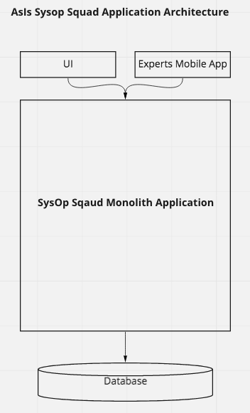
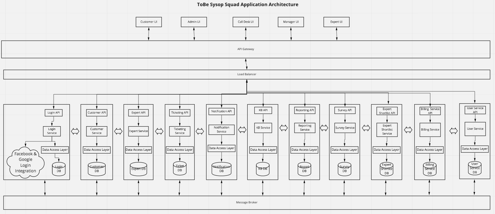

# Solution Overview

## Principles
1. Adding value to the customer.
1. Self service / Automation where possible.
1. Use Open source component, reuse before a buy or a build. 
1. Technology Independent. Avoid a vendor lock-in.
1. Easy to use and maintain.

## Summary
After analysing the problem statement and current application architecture of Penultimate Electronics, its identified that
the current system is a monolith, and some key functionalities doesn't work reliably.     

##### As-Is Architecture

##### To-Be Architecture
The Purposed Architecture is to break the current monolith into microservices architecture.  

**Key Architectural Points**
1. Current application will be divided into multiple [microservices](./MicroServices.md).
1. Reuse the services where possible. The existing component to microservice mapping can be found [here](img/ServiceMapping.png)
1. Ticket assignment service is re-designed as Expert Selection microservice based on UBER model, details can be found [here](3.%20Perspectives)
1. Message Broker queues and guaranteed delivery will be used for inter-service communication.
1. Big Bang migration approach.
1. Create robust regression test suite to have confidence in moved, changed and newly created services. 
1. On demand scaling of microservices to achieve high availability. 
1. Disaster recovery of the system will be handled by Active-Passive deployment. Details are [here](DisasterRecovery.md).
1. Purposed business process changes 
    1. Purposed responsibilities addition to the manager role for some corner case scenario's
    1. Expert will commit to the customer visit himself, rather than assigned.   

